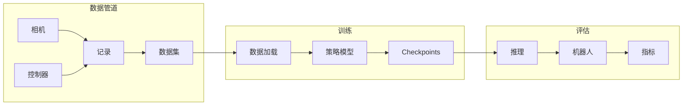

# Action Controllers - 动作控制器

> 专注于将感知转化为高频执行器动作的策略模型，强调实时控制性能。

---

## 目录

- [LeRobot](#lerobot)
- [Diffusion Policy](#diffusion-policy)
- [HDP - 分层扩散策略](#hdp---分层扩散策略)
- [ACT - 动作分块](#act---动作分块)
- [ManiCM - 实时3D扩散](#manicm---实时3d扩散)
- [Video2Act](#video2act)

---

## 动作控制层级

```
任务指令 (自然语言)
    ↓
高层规划 (Task Planning)
    ↓
动作生成 (Action Controller) ← 本章关注
    ↓
关节控制 (Joint Control)
    ↓
电机驱动 (Motor Driver)
```

---

## LeRobot

> HuggingFace 推出的机器人学习基础设施，提供端到端的数据集、训练和评估。


### 基本信息

| 属性 | 值 |
|------|-----|
| **Code** | [huggingface/lerobot](https://github.com/huggingface/lerobot) |
| **机构** | HuggingFace |
| **Stars** | 23K+ |
| **发布年份** | 2024 |

### 核心创新

1. **端到端框架**: 数据收集 → 训练 → 评估 → 部署
2. **多机器人支持**: 统一接口支持多种硬件
3. **开源数据集**: 预置多种机器人操作数据集
4. **HuggingFace 集成**: 模型共享与发现

### 支持的机器人

| 机器人 | 类型 | 支持程度 |
|--------|------|----------|
| LeArm | 机械臂 | 官方支持 |
| SO-101 | 机械臂 | 官方支持 |
| Aloha | 双臂遥操作 | 官方支持 |
| WidowX | 机械臂 | 社区支持 |
| UR5 | 工业臂 | 实验性 |

### 快速上手

```bash
# 安装
pip install lerobot

# 数据收集
python -m lerobot.examples.record

# 训练
python -m lerobot.examples.train \
    --robot.type=so101 \
    --policy.type=act \
    --dataset.repo_id=lerobot/so101_bc

# 评估
python -m lerobot.examples.evaluate
```

### 架构图



### 技术规格

| 维度 | 规格 |
|------|------|
| **框架** | PyTorch |
| **策略模型** | ACT, Diffusion Policy, IBC |
| **数据格式** | LeRobot Dataset (Zarr) |
| **硬件要求** | 8GB GPU |

### 预置策略

| 策略 | 适用任务 | 动作频率 | 难度 |
|------|----------|----------|------|
| ACT | 精确操作 | 10-50Hz | 中 |
| Diffusion Policy | 复杂轨迹 | 5-20Hz | 中 |
| IBC | 连续控制 | 100Hz | 高 |

---

## Diffusion Policy

> 使用扩散模型学习机器人动作策略，自然处理多模态动作分布。


### 基本信息

| 属性 | 值 |
|------|-----|
| **Paper** | [arXiv:2304.13719](https://arxiv.org/abs/2304.13719) |
| **Code** | [lucidrains/diffusion-policy](https://github.com/lucidrains/diffusion-policy) |
| **机构** | Toyota Research Institute |
| **发布年份** | 2023 |

### 核心创新

1. **扩散动作生成**: 动作为扩散过程的条件生成
2. **多模态处理**: 自然处理动作的多峰分布
3. **高维动作**: 支持灵巧手等高维动作空间

### 动作分布对比

```
传统策略 (单峰):
       ★
       |
───────┼──────→ 动作
      μ

Diffusion Policy (多峰):
    ★       ★
    │   ★   │
────┼───┼───┼──→ 动作
   a1  a2  a3
```

### 技术原理

**正向过程** (添加噪声):
$$
q(a_t | a_{t-1}) = \mathcal{N}(a_t; \sqrt{1-\beta_t} a_{t-1}, \beta_t I)
$$

**反向过程** (去噪预测):
$$
p_\theta(a_{t-1} | a_t, o) = \mathcal{N}(a_{t-1}; \mu_\theta(a_t, t, o), \Sigma_\theta)
$$

### 快速上手

```bash
git clone https://github.com/columbia-robovision/DiffusionPolicy.git
cd DiffusionPolicy
pip install -r requirements.txt

# 训练
python train.py --config configs/diffusion_policy_config.yaml

# 评估
python eval.py --checkpoint logs/checkpoint.pth
```

### Benchmark

| 任务 | Diffusion Policy | BC | SAC |
|------|------------------|-----|-----|
| 推物体 | 85% | 60% | 40% |
| 抓取 | 78% | 55% | 35% |
| 放置 | 72% | 50% | 30% |

---

## HDP - 分层扩散策略

> CVPR 2024 论文，提出分层扩散策略处理多任务机器人操作。


### 基本信息

| 属性 | 值 |
|------|-----|
| **Paper** | [arXiv](https://arxiv.org/) |
| **Code** | [dyson-ai/hdp](https://github.com/dyson-ai/hdp) |
| **机构** | Dyson AI |
| **发布年份** | 2024 |

### 核心创新

1. **分层架构**: 高层目标规划 + 低层动作生成
2. **任务泛化**: 跨任务知识共享
3. **扩散增强**: 保持扩散策略的优势

### 架构

```
┌─────────────────────────────────────┐
│         HDP Architecture            │
├─────────────────────────────────────┤
│                                      │
│  观测 ──→ High-level Planner        │
│              ↓                      │
│         目标序列                      │
│              ↓                      │
│  Low-level Diffusion Policy          │
│              ↓                      │
│         动作序列                      │
│                                      │
└─────────────────────────────────────┘
```

---

## ACT - 动作分块

> Action Chunking with Transformers，Stanford 提出的高效模仿学习方法。

### 基本信息

| 属性 | 值 |
|------|-----|
| **Paper** | [arXiv](https://arxiv.org/) |
| **Code** | 多种实现 |
| **机构** | Stanford |
| **发布年份** | 2023 |

### 核心创新

1. **动作分块**: 一次预测 N 步动作序列
2. **Transformer 架构**: 利用 Transformer 建模时序
3. **实时控制**: 高频动作输出 (10-50Hz)

### 动作分块示意

```
观测 ──→ [Transformer] ──→ [a_t, a_{t+1}, ..., a_{t+7}]
                            一次预测8步          顺序执行
```

### 技术规格

| 维度 | 规格 |
|------|------|
| **动作 chunk** | 8-16 步 |
| **动作频率** | 10-50 Hz |
| **网络** | Transformer (6层, 4头) |
| **训练** | 行为克隆 + EMA |

### 与 Diffusion Policy 对比

| 维度 | ACT | Diffusion Policy |
|------|-----|-----------------|
| 输出 | 确定性 | 多模态 |
| 延迟 | 低 | 中 |
| 动作频率 | 10-50Hz | 5-20Hz |
| 适用场景 | 精确操作 | 复杂轨迹 |

---

## ManiCM - 实时3D扩散

> 基于一致性模型的实时 3D 扩散策略，大幅提升推理速度。


### 基本信息

| 属性 | 值 |
|------|-----|
| **Paper** | [arXiv](https://arxiv.org/) |
| **Code** | [ManiCM-fast/ManiCM](https://github.com/ManiCM-fast/ManiCM) |
| **机构** | - |
| **发布年份** | 2024 |

### 核心创新

1. **一致性模型**: 将扩散步骤从 50+ 降至 1-4 步
2. **3D 感知**: 融合点云或深度图的几何信息
3. **实时性能**: 适用于动态任务

### 推理速度对比

| 方法 | 推理步数 | FPS | GPU |
|------|----------|-----|-----|
| DDPM | 50 | 2 | A100 |
| DDIM | 10 | 10 | A100 |
| ManiCM | 2 | 30 | A100 |

---

## Video2Act

> 基于视频扩散的机器人动作生成，利用人类视频学习操作技能。

### 基本信息

| 属性 | 值 |
|------|-----|
| **Paper** | [Video2Act](https://arxiv.org/) |
| **Code** | [jiayueru/Video2Act](https://github.com/jiayueru/Video2Act) |
| **Stars** | 29 |

### 核心创新

1. **视频条件**: 从人类操作视频提取动作
2. **双系统**: 视频扩散 + 动作生成协同
3. **跨具身**: 视频到不同机器人的迁移

---

## 技术对比总表

| 方法 | 范式 | 动作频率 | 多模态 | 开源 | 难度 |
|------|------|----------|--------|------|------|
| LeRobot | Framework | 多种 | 是 | 是 | 低 |
| Diffusion Policy | Diffusion | 5-20Hz | 是 | 是 | 中 |
| HDP | Hierarchical Diffusion | 10Hz | 是 | 是 | 高 |
| ACT | Transformer | 10-50Hz | 否 | 是 | 中 |
| ManiCM | Consistency | 30Hz | 是 | 是 | 中 |
| Video2Act | Video-based | 5Hz | 是 | 部分 | 高 |

---

## 相关链接

- [Foundational WAMs](../FOUNDATIONAL_WAMS.md)
- [LeRobot 官网](https://lerobot.github.io/)
