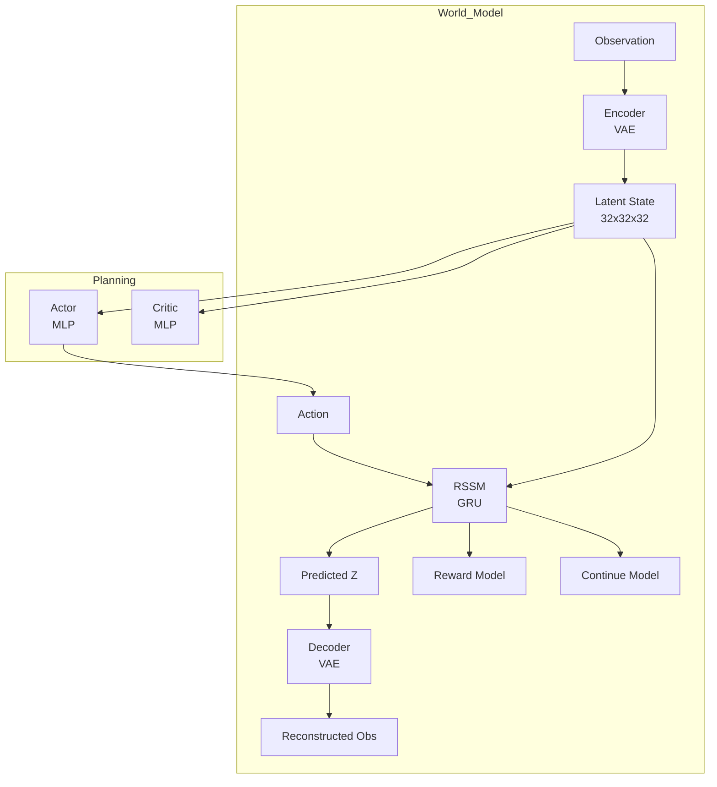

# Predictive Dynamics - 预测动力学

> 专注于环境未来状态预测的模型，核心是学习"如果我这样做，环境会如何变化"。

---

## 目录

- [Dreamer 系列](#dreamer-系列)
- [GAIA-1](#gaia-1)
- [FlowDreamer](#flowdreamer)
- [UniSim](#unisim)

---

## 核心概念

### World Model 的核心方程

$$
\hat{s}_{t+1} = f(s_t, a_t; \theta)
$$

其中 $s_t$ 是环境状态，$a_t$ 是动作，$f$ 是学习到的动态模型。

### 与基础模型的区别

```
基础模型问: "我应该做什么动作？"
预测模型问: "如果我做了这个动作，环境会变成什么样？"
```

### 技术优势

| 优势 | 说明 |
|------|------|
| **数据效率** | 想象力 rollout 可复用模型 |
| **可解释性** | 可视化环境预测 |
| **规划能力** | 支持 MPC / 搜索 |
| **长程预测** | 可预测 100+ 步未来 |

---

## Dreamer 系列

> DeepMind 开发的系列世界模型，从 PlaNet 到 DreamerV3 持续演进。

### DreamerV3

**核心创新**: 首个统一算法，同时处理强化学习和模仿学习，支持跨域迁移。


| 属性 | 值 |
|------|-----|
| **Paper** | [arXiv:2301.04104](https://arxiv.org/abs/2301.04104) |
| **Code** | [danijar/dreamerv3](https://github.com/danijar/dreamerv3) |
| **机构** | DeepMind |
| **发布年份** | 2023 |

### 核心架构



### 技术规格

| 维度 | 规格 |
|------|------|
| **核心范式** | RSSM (Recurrent State Space Model) |
| **隐空间** | 32x32x32 离散表征 |
| **训练方式** | Dreaming (想象力 rollout) |
| **策略类型** | Actor-Critic |

### Benchmark

| 环境 | DreamerV3 | DreamerV2 | SAC |
|------|-----------|-----------|-----|
| DeepMind Lab | 700+ | 500+ | 100 |
| Atari 100K | 200+ | 180+ | 150 |
| Manipulator | 85% | 70% | 50% |

### 快速上手

```bash
git clone https://github.com/danijar/dreamerv3.git
cd dreamerv3
pip install -e .

# 训练
python -m dreamerv3.train --env dmc_walker_walk
```

### 消融实验

| 组件 | 配置 | 效果 |
|------|------|------|
| 表征维度 | 32 vs 64 | 32 足够 |
| imagination horizon | 15 vs 50 | 15 最优 |
| KL 平衡 | 固定 vs 适应 | 适应更好 |

---

## GAIA-1

> Wayve 开发的自动驾驶生成式世界模型，学习驾驶场景的动态演化。

### 基本信息

| 属性 | 值 |
|------|-----|
| **Paper** | [arXiv](https://arxiv.org/) |
| **机构** | Wayve |
| **发布年份** | 2023 |

### 核心创新

1. **生成式世界模型**: 生成逼真的驾驶场景视频
2. **动作感知**: 学习动作如何影响未来场景
3. **零样本预测**: 可预测未见过的动作组合

### 技术规格

| 维度 | 规格 |
|------|------|
| **核心范式** | Video Diffusion + Action Conditioning |
| **预测目标** | 未来视频帧 |
| **动作空间** | 连续 (转向/加速) |
| **时域** | 1-5 秒预测 |

### 应用场景

- 自动驾驶仿真
- 场景生成
- 反事实推理

---

## FlowDreamer

> 基于光流的机器人操作世界模型，学习精确的运动表征。

### 基本信息

| 属性 | 值 |
|------|-----|
| **Paper** | RA-L 2026 |
| **Code** | [sharinka0715/FlowDreamer](https://github.com/sharinka0715/FlowDreamer) |
| **Stars** | 12 |

### 核心创新

1. **光流运动表征**: 使用光流而非像素预测
2. **RGB-D 输入**: 深度信息增强几何感知
3. **精确运动预测**: 适用于精确操作任务

### 技术规格

| 维度 | 规格 |
|------|------|
| **核心范式** | Flow-based World Model |
| **输入** | RGB-D 图像 |
| **预测目标** | 光流场 |
| **应用** | 机器人操作 |

---

## UniSim

> 统一的视觉-语言-动作模拟器，融合世界模型与数据生成。

### 基本信息

| 属性 | 值 |
|------|-----|
| **Paper** | [UniSim](https://arxiv.org/) |
| **机构** | NVIDIA / Berkeley |
| **发布年份** | 2024 |

### 核心创新

1. **统一框架**: 视觉预测 + 语言描述 + 动作控制
2. **数据生成**: 大规模合成机器人数据
3. **闭环仿真**: 支持策略在环测试

---

## 技术对比

| 项目 | 范式 | 预测目标 | 规划能力 | 开源 |
|------|------|----------|----------|------|
| DreamerV3 | RSSM | 隐状态 | 强 | 是 |
| GAIA-1 | Diffusion | 视频 | 弱 | 否 |
| FlowDreamer | Flow | 光流 | 中 | 部分 |
| UniSim | Hybrid | 多模态 | 中 | 否 |

---

## Model-Based RL 流程

```
┌─────────────────────────────────────────────────────────────┐
│              Model-Based Reinforcement Learning             │
├─────────────────────────────────────────────────────────────┤
│                                                              │
│   [真实环境] ──→ 收集数据 ──→ 学习 World Model              │
│                          │                                  │
│                          ↓                                  │
│                    Dreaming Rollout                          │
│                          │                                  │
│                          ↓                                  │
│              想象力环境中的策略优化                          │
│                          │                                  │
│                          ↓                                  │
│              真实环境执行优化后的策略                        │
│                          │                                  │
│                          ↓                                  │
│                    [回到收集数据]                            │
│                                                              │
└─────────────────────────────────────────────────────────────┘
```

---

## 学习资源

### 必读论文

1. **PlaNet** (Hafner et al., 2019) - 隐式世界模型奠基
2. **DreamerV2** (Hafner et al., 2020) - RSSM 完善
3. **DreamerV3** (Hafner et al., 2023) - 统一算法

### 开源实现

- [danijar/dreamerv3](https://github.com/danijar/dreamerv3) - 官方 JAX 实现
- [AShaiJae/dreamerv3-pytorch](https://github.com/AShaiJae/dreamerv3-pytorch) - PyTorch 实现

---

## 相关链接

- [Action Controllers](../ACTION_CONTROLLERS.md)
- [Simulation & Sim2Real](../SIMULATION_REAL2SIM.md)
