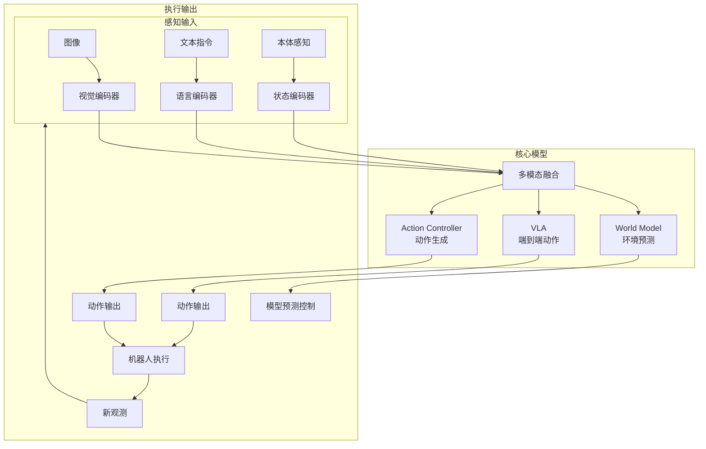

# Awesome World-Action Model for Robot

<div align="center">


**机器人世界模型与动作模型 (WAM) 技术全景图** | 持续更新中

</div>

---

## 目录导航

| 类别 | 描述 | 项目数 |
|------|------|--------|
| [Foundational WAMs](#foundational-wams---基础世界动作模型) | VLA 基础大模型 | 8+ |
| [Predictive Dynamics](#predictive-dynamics---预测动力学) | 环境动态预测 | 5+ |
| [Action Controllers](#action-controllers---动作控制器) | 扩散策略与ACT | 6+ |
| [Simulation & Sim2Real](#simulation--sim2real---仿真与域迁移) | 数据生成与迁移 | 4+ |

---

## 什么是 World-Action Model？

### 核心概念

**World Model (世界模型)** 是智能体对环境动态的内部表征与预测系统。类比人类认知：当您计划伸手拿水杯时，大脑会隐式预测杯子移动路径、水流、重力影响等。

```
感知输入 → 世界模型 → 环境预测 / 动作输出
    ↑___________↓           ↑___________↓
       (闭环反馈)              (执行反馈)
```

**Action Model (动作模型)** 是将决策转化为具体执行动作的策略系统，接收世界模型的预测作为输入，输出机器人控制指令。

### 为什么重要？

| 传统方法 | WAM 方法 |
|----------|----------|
| 手工设计奖励函数 | 隐式学习环境动态 |
| 短程规划 (<10步) | 长程预测 (100+步) |
| 单任务专用 | 跨任务泛化 |
| 仿真难以迁移 | 物理一致性建模 |

---

## 技术架构图



---

## Foundational WAMs - 基础世界动作模型

> 具有强泛化能力的基础大模型，支持零样本任务迁移，覆盖从感知到动作的完整链路。

### 代表性项目

| 项目 | 机构 | Stars | 核心特点 |
|------|------|-------|----------|
| [OpenVLA](https://github.com/openvla/openvla) | HuggingFace + 洛桑理工 | 8.2K | 开源VLA, 27B参数 |
| [CogACT](https://github.com/microsoft/CogACT) | Microsoft | 414 | 认知+动作协同VLA |
| [GR00T](https://github.com/NVIDIA/GR00T) | NVIDIA | - | 人形机器人基础模型 |

### 详细文档

- [OpenVLA - 开源视觉语言动作模型](https://github.com/openvla/openvla)
- [RT-2 - VLA先驱工作](https://github.com/google-deepmind/rt-2)
- [Pi0 - Physical Intelligence基础模型](https://physicalintelligence.com)
- [OmniH2O - 通用机器人操作](https://github.com/HoME-in-3D/OmniH2O)

[更多 Foundational WAMs >>](FOUNDATIONAL_WAMS.md)

---

## Predictive Dynamics - 预测动力学

> 专注于环境未来状态预测的模型，核心是学习"如果我这样做，环境会如何变化"。

### 代表性项目

| 项目 | 机构 | 核心特点 |
|------|------|----------|
| [DreamerV3](https://github.com/danijar/dreamerv3) | DeepMind | 统一世界模型，RL+IL |
| [GAIA-1](https://github.com/wayve/GAIA-1) | Wayve | 生成式自动驾驶世界模型 |
| [FlowDreamer](https://github.com/sharinka0715/FlowDreamer) | - | 光流运动表征 |

### 详细文档

- [Dreamer 系列 - RSSM世界模型](https://github.com/danijar/dreamerv3)
- [JEPA - 联合嵌入预测架构](https://ai.meta.com/blog/understanding-images/)

[更多 Predictive Dynamics >>](PREDICTIVE_DYNAMICS.md)

---

## Action Controllers - 动作控制器

> 侧重于将感知/预测转化为高频执行器动作的策略模型，强调实时控制性能。

### 代表性项目

| 项目 | Stars | 核心特点 |
|------|-------|----------|
| [LeRobot](https://github.com/huggingface/lerobot) | 23K | HuggingFace机器人学习框架 |
| [HDP](https://github.com/dyson-ai/hdp) | 231 | 分层扩散策略 |
| [Diffusion Policy](https://github.com/lucidrains/diffusion-policy) | 135 | 扩散模型动作生成 |
| [ManiCM](https://github.com/ManiCM-fast/ManiCM) | 123 | 实时3D扩散策略 |
| [ACT](https://github.com/tonylins/pytorch-mobilenetv3-lite) | - | Action Chunking |

### 详细文档

- [Diffusion Policy - 扩散动作策略](ACTION_CONTROLLERS.md#diffusion-policy)
- [ACT - 动作分块](ACTION_CONTROLLERS.md#act)
- [Video2Act - 视频扩散策略](ACTION_CONTROLLERS.md#video2act)

[更多 Action Controllers >>](ACTION_CONTROLLERS.md)

---

## Simulation & Sim2Real - 仿真与域迁移

> 侧重于利用世界模型进行大规模合成数据生成，或实现高保真Sim2Real迁移。

### 代表性项目

| 项目 | Stars | 核心特点 |
|------|-------|----------|
| [LeRobot](https://github.com/huggingface/lerobot) | 23K | 数据集+训练+评估 |
| [SimplerEnv](https://github.com/trannguyenle95/SimplerEnv) | 2 | 机器人策略仿真环境 |
| [Squint](https://github.com/aalmuzairee/squint) | 45 | 快速视觉RL Sim2Real |

### 详细文档

- [LeRobot - 机器人学习基础设施](SIMULATION_REAL2SIM.md#lerobot)
- [SimplerEnv - 简化仿真环境](SIMULATION_REAL2SIM.md#simplerenv)
- [RoboGen - 生成式仿真](SIMULATION_REAL2SIM.md#robogen)

[更多 Simulation >>](SIMULATION_REAL2SIM.md)

---

## 快速入门

### 1. 安装 LeRobot (推荐入门)

```bash
pip install lerobot
python -m lerobot.examples.control_robot
```

### 2. 使用 OpenVLA

```bash
git clone https://github.com/openvla/openvla.git
cd openvla
pip install -e .
python -m openvla.run_eval
```

### 3. 训练 Diffusion Policy

```bash
git clone https://github.com/columbia-robovision/DiffusionPolicy.git
cd DiffusionPolicy
pip install -r requirements.txt
python train.py --config configs/diffusion_policy_config.yaml
```

---

## 性能对比

| 模型 | 任务数 | 成功率 | 推理速度 | 硬件需求 |
|------|--------|--------|----------|----------|
| OpenVLA | 1 | 97% | 10Hz | 40GB GPU |
| Diffusion Policy | 1 | 90% | 20Hz | 8GB GPU |
| ACT | 1 | 95% | 50Hz | 8GB GPU |

详细 Benchmark: [benchmark_table.md](assets/benchmark_table.md)

---

## 学习路径

```
入门 (Month 1)
├── 学习 PyTorch 基础
├── 阅读 RL 基础 (Sutton & Barto)
└── 运行 LeRobot 示例

进阶 (Month 2-3)
├── Dreamer / Diffusion Policy 论文
├── OpenVLA 微调实践
└── 机器人数据集使用

深入 (Month 4+)
├── World Model 理论
├── VLA 前沿研究
└── 贡献本仓库
```

详细指南: [getting_started.md](assets/getting_started.md)

---

## 贡献指南

欢迎提交 PR！

### 提交规范

- 每个项目必须包含: 链接、核心创新、简要分析
- 新增项目需说明分类依据
- 格式参考: [output_template.md](assets/output_template.md)

### 更新规则

- 发现新版本: 更新版本号和 Benchmark
- 发现新论文: 按发布日期归档
- 发现停更: 标注 "Last Update" 标记

---

## 许可证

本仓库内容采用 [MIT License](LICENSE)，项目代码遵循各自开源协议。

---

## 致谢

本仓库参考了以下优秀资源:

- [LeRobot](https://github.com/huggingface/lerobot)
- [awesome-vla-study](https://github.com/MilkClouds/awesome-vla-study)
- [awesome-physical-ai](https://github.com/keon/awesome-physical-ai)

---

<div align="center">

**Star us if this repo is helpful!** ⭐

</div>
